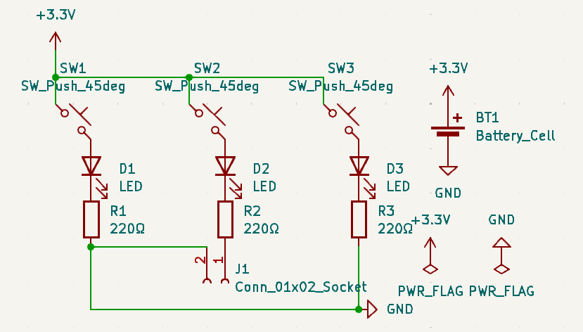
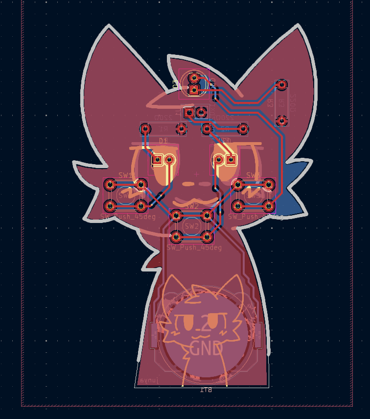
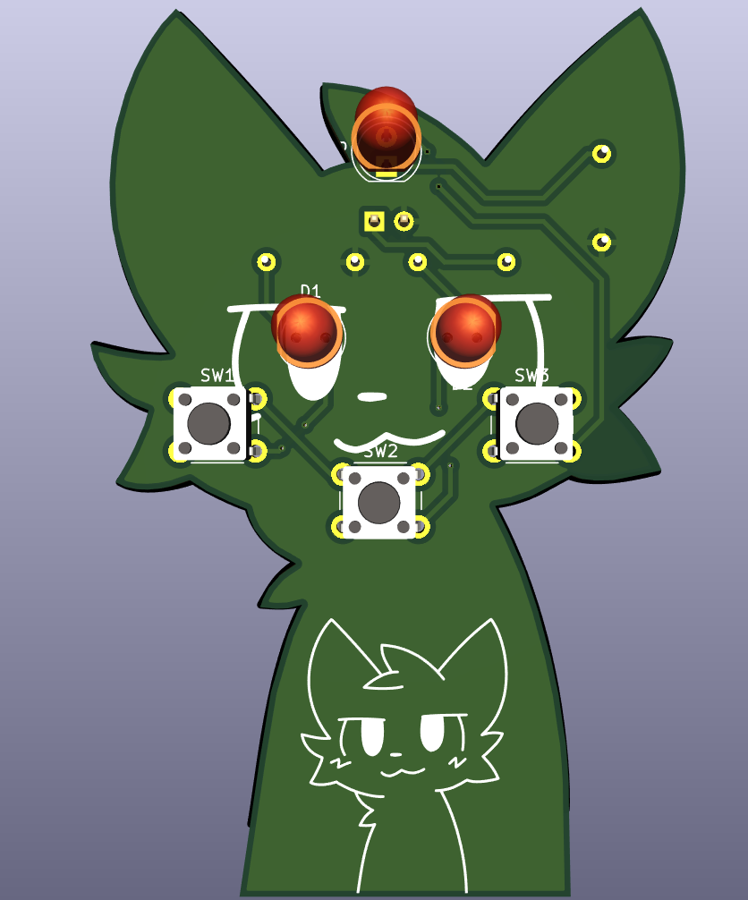
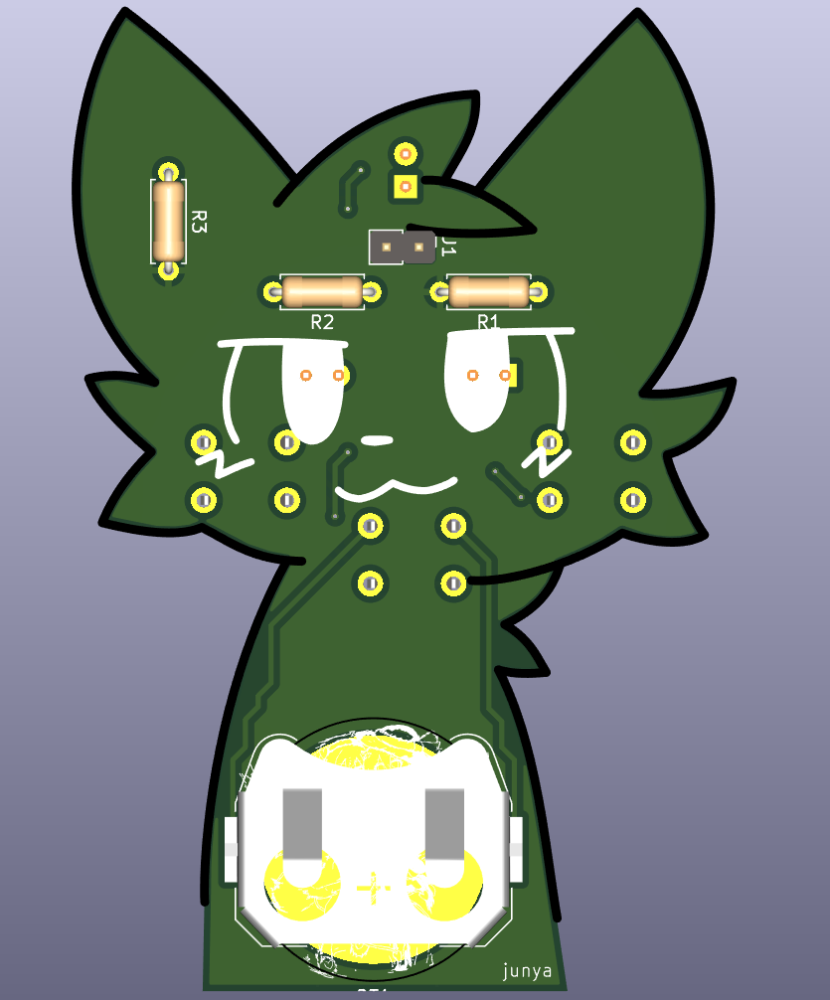

# Boykisser PCB

A small hardware project with some basic parts, cut in the shape of a Boykisser :3

## BOM

- 1x CR2032 Battery Holder (Keystone_3034_1x20mm)
- 3x LEDs 5.0mm (THT)
- 1x Mini vibrator motor disc
- 3x 220Ω Resistors (THT)
- 3x Button Switch Push 6.0mm (THT)

## Concept

| Demo             |                    Image                     |
|------------------|:--------------------------------------------:|
| Schematic        |            |
| PCB Design       |                 |
| PCB Front Render |  |
| PCB Back Render  |    |
